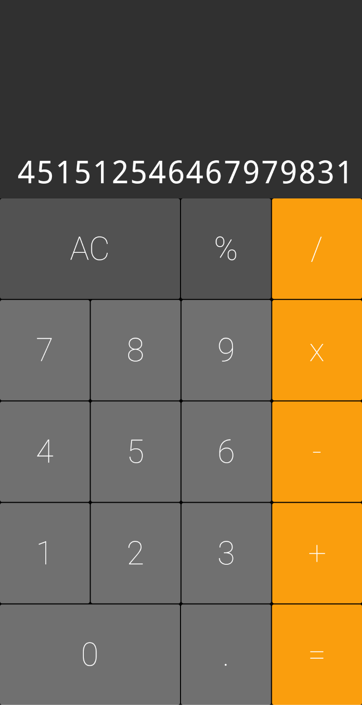

# Calculadora

Projeto de uma calculadora utilizando Flutter

## Sobre

Projeto feito para simular uma calculadora utilizando o framework do Flutter.

## Bibliotecas utilizadas

'auto_size_text' para redimensionar os digitos do display quando atingem a borda da tela.

## Screenshots

  
   
  

